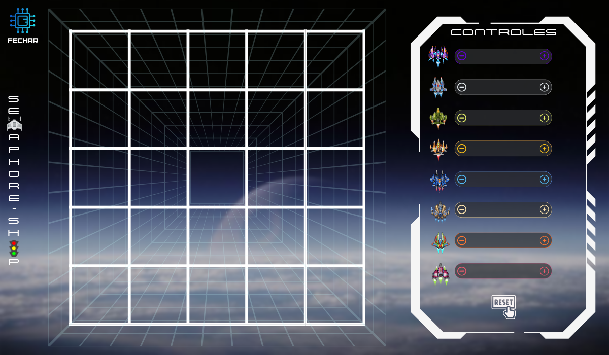

# Semaphore Ship

Simulação em JavaFX de naves percorrendo uma malha compartilhada, com controle de concorrência por semáforos para evitar colisões em ruas e esquinas.



## Requisitos

- Java 8
- JavaFX disponível no JDK

## Como compilar

```bash
javac Principal.java
```

## Como executar

```bash
java Principal
```

## Estrutura

- `Principal.java`: ponto de entrada da aplicação.
- `controller/ControllerTelaPrincipal.java`: controla a interface, sliders, botões e inicialização das naves.
- `model/ThreadNave.java`: implementa as threads, movimentação, rotas e controle de semáforos.
- `view/telaPrincipal.fxml`: layout da tela principal.
- `assets/`: imagens da malha, naves, botões e percursos.

## Funcionalidades

- Oito naves com percursos próprios.
- Velocidade individual controlada por sliders.
- Botões para pausar, retomar e exibir percursos.
- Controle de concorrência nas regiões compartilhadas da malha.
